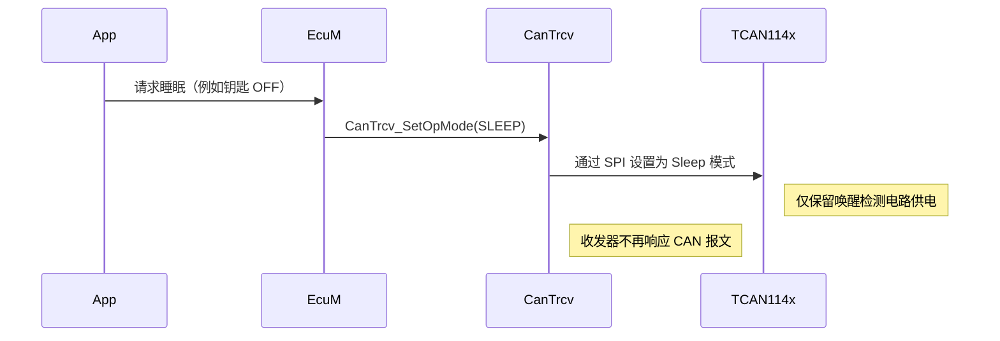
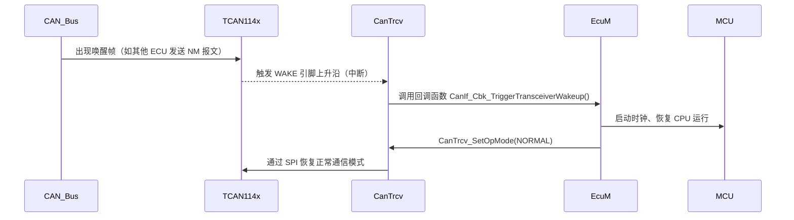
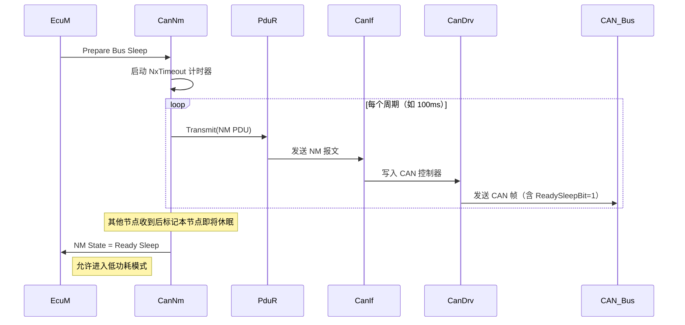
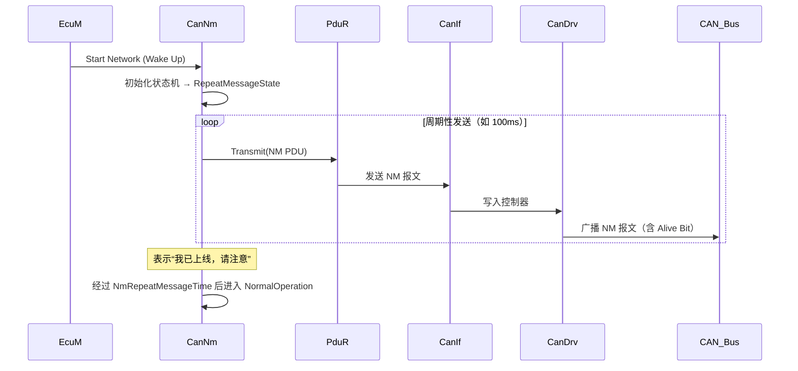
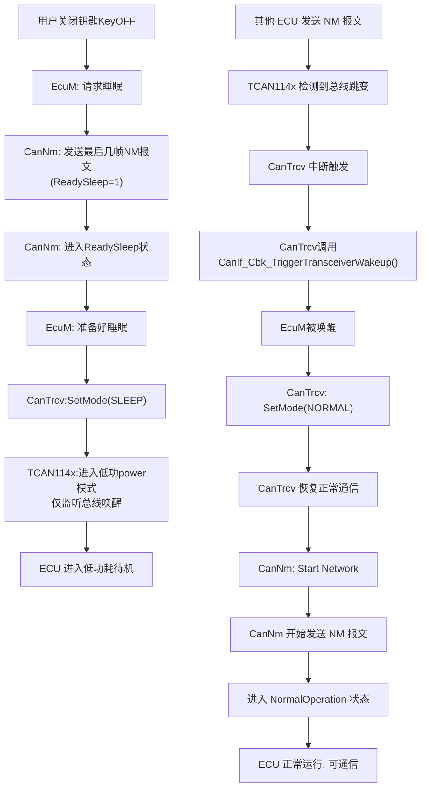

#### CanTrcv（CAN 收发器管理器）：通过SPI控制硬件TCAN114x芯片(can收发器)的工作状态，如正常模式、睡眠模式、唤醒模式
CAN收发器是CAN总线系统的核心硬件组件，连接CAN控制器（负责协议处理，如单片机内置的CAN模块，输出的是 TTL/CMOS 电平的数字信号）与物理CAN总线（如双绞线），**实现“数字逻辑信号”和“总线差分信号”的双向转换**，同时提供总线驱动、电平匹配和保护功能。

|对比项|CanTrcv|CanNM|
|---|---|---|
|所属层级|微控制器抽象层MCAL|通讯服务层BSW|
|物理实物|控制CAN收发芯片硬件（如TCAN114x）|软件协议栈，运行在CPU上|
|主要职责|开关收发器电源，响应总线唤醒信号|发送/接收网络管理报文/调节节点睡眠同步|
|休眠控制方式|设置收发器为Sleep模式（低功耗）|发送最后一个NM报文后请求进入Passive状态|
|唤醒检测方式|检测总线上的显性电平变化（硬件级）|收到NM PDU后认为被唤醒，启动通信|

***

**CanTrcv休眠流程**(ECU触发)

**CanTrcv唤醒流程**(外部触发)

**CanNM休眠流程**

**CanNM唤醒流程**

**整体协同流程图**
