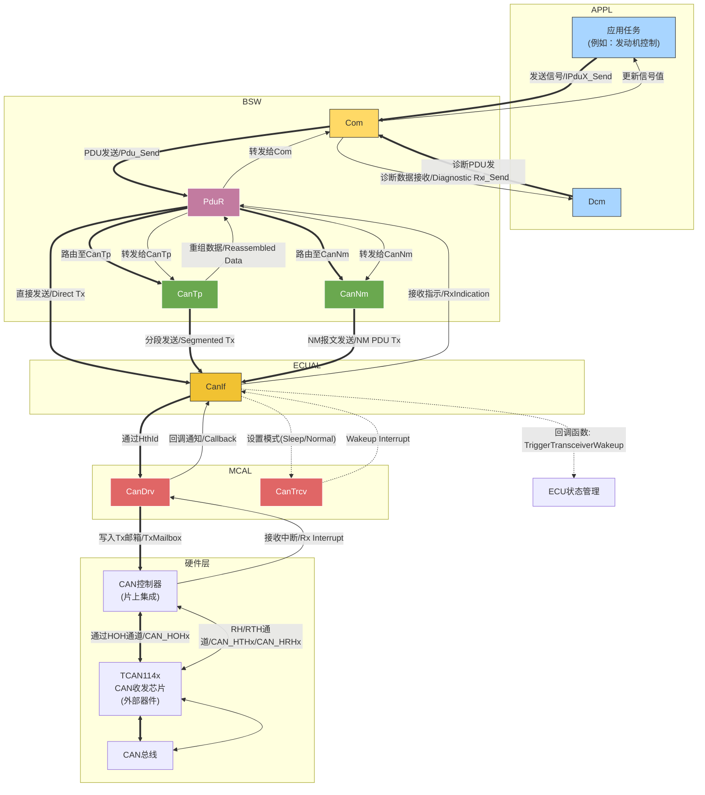
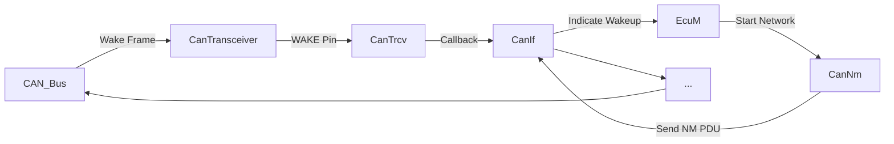

#### AUTOSAR通信栈全貌
**应用层 ---> BSW服务层 ---> MCU抽象层MCAL ---> CAN硬件**
粗线为发送路径（从上层到硬件）
细线为接收路径（从硬件到上层）
虚线为CanTrcv控制线（休眠/唤醒相关）

```mermaid
graph TD
    subgraph APPL
        App["应用任务<br>(例如：发动机控制)"]
        Dcm[Dcm]
    end

    subgraph BSW
        Com[Com]
        PduR[PduR]
        CanNm[CanNm]
        CanTp[CanTp]
    end

    subgraph ECUAL
        CanIf[CanIf]
    end

    subgraph MCAL
        CanDrv[CanDrv]
        CanTrcv[CanTrcv]
    end

    subgraph 硬件层
        CanCtrl["CAN控制器<br>(片上集成)"]
        CanTransceiver["TCAN114x<br>CAN收发芯片<br>(外部器件)"]
        CAN_Bus[CAN总线]
    end

    %% 发送路径（从上层到硬件）
    App ==>|发送信号/IPduX_Send| Com
    Dcm ==>|诊断PDU发送/Diag_Pdu_Send| Com
    Com ==>|PDU发送/Pdu_Send| PduR
    PduR ==>|路由至CanTp| CanTp
    PduR ==>|路由至CanNm| CanNm
    PduR ==>|直接发送/Direct Tx| CanIf
    CanTp ==>|分段发送/Segmented Tx| CanIf
    CanNm ==>|NM报文发送/NM PDU Tx| CanIf
    CanIf ==>|通过HthId| CanDrv
    CanDrv ==>|写入Tx邮箱/TxMailbox| CanCtrl
    CanCtrl <==>|通过HOH通道/CAN_HOHx| CanTransceiver
    CanTransceiver <==> CAN_Bus

    %% 接收路径（从硬件到上层）
    CAN_Bus <--> CanTransceiver
    CanTransceiver <-->|RH/RTH通道/CAN_HTHx/CAN_HRHx| CanCtrl
    CanCtrl -->|接收中断/Rx Interrupt| CanDrv
    CanDrv -->|回调通知/Callback| CanIf
    CanIf -->|接收指示/RxIndication| PduR
    PduR -->|转发给CanTp| CanTp
    PduR -->|转发给CanNm| CanNm
    PduR -->|转发给Com| Com
    CanTp -->|重组数据/Reassembled Data| PduR
    Com -->|更新信号值| App
    Com -->|诊断数据接收/Diagnostic Rx| Dcm

    %% CanTrcv 控制线（休眠/唤醒相关）
    CanIf -.->|"设置模式(Sleep/Normal)"| CanTrcv
    CanTrcv -.->|Wakeup Interrupt| CanIf
    CanIf -.->|回调函数: TriggerTransceiverWakeup| EcuM[ECU状态管理]

    style App fill:#a8d5ff,stroke:#333
    style Dcm fill:#a8d5ff,stroke:#333
    style Com fill:#ffd966,stroke:#333
    style PduR fill:#c27ba0,stroke:#fff,color:#fff
    style CanNm fill:#6aa84f,stroke:#fff,color:#fff
    style CanTp fill:#6aa84f,stroke:#fff,color:#fff
    style CanIf fill:#f1c232,stroke:#333
    style CanDrv fill:#e06666,stroke:#fff,color:#fff
    style CanTrcv fill:#e06666,stroke:#fff,color:#fff
```

***

### 数据流动示例（两个经典场景）
**场景一：发送一个长诊断响应（>8字节）**

```mermaid
flowchart LR
    Dcm -- "Response(20B)" --> Com
    Com -- PDU --> PduR
    PduR -- Route to CanTp --> CanTp
    CanTp -- Segment into FF+CFs --> CanIf
    CanIf --> CanDrv
    CanDrv --> CanCtrl --> CanTransceiver --> CAN_Bus
```
**场景二：ECU被唤醒后加入网络**

```mermaid
flowchart LR
    CAN_Bus -- Wake Frame --> CanTransceiver
    CanTransceiver -- WAKE Pin --> CanTrcv
    CanTrcv -- Callback --> CanIf
    CanIf -- Indicate Wakeup --> EcuM
    EcuM -- Start Network --> CanNm
    CanNm -- Send NM PDU --> CanIf --> ... --> CAN_Bus
```