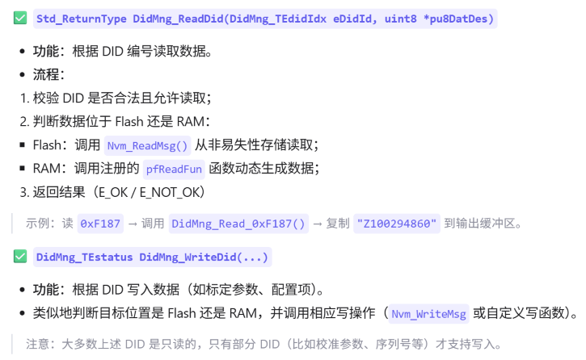

DID（Data Identifier）该模块的主要职责是：
	• 管理各种DID数据的读写访问；
	• 将不同的DID映射到具体的内存数据或函数处理逻辑；
	• 支持从Flash或RAM中读写数据；
	• 提供标准化接口供上层诊断组件（如DCM-Diagnostic Communication Manager）调用；
    • 实现一些与车辆状态相关的诊断信息暴露，例如硬件版本、软件版本、故障码等。
    
以df_inf_appl为例子：
|DID|含义|
|:---|:---|
|F179|OEM 硬件版本|
|F187|OEM 零部件编号|
|F189|OEM 软件版本|
|F193|ECU 硬件版本号字符串|
|F195|ECU 软件版本号字符串|
|F197|系统名称|
|F199|软件发布日期|
|F172|故障状态位图|

与其他模块的关系：
|模块|作用|关联方式|
|:---|:---|:---|
|DCM|接收UDS请求（如0x22 F195）|调用DidMng_ReadDid()|
|RTE|提供运行时环境|包含Rte_Dcm.h|
|NvM|管理Flash读写|调用Nvm_ReadMsg/WriteMsg|
|FaultMng|管理故障状态|查询当前故障是否激活|
|Com/DcdcCom|上报事件或发送信号|在写DID侯触发通信|

