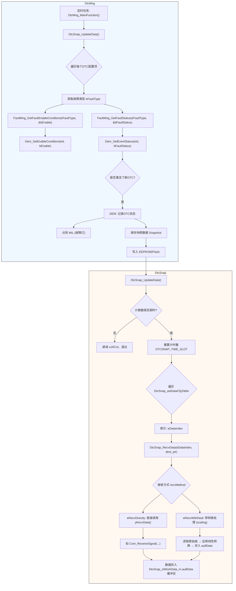
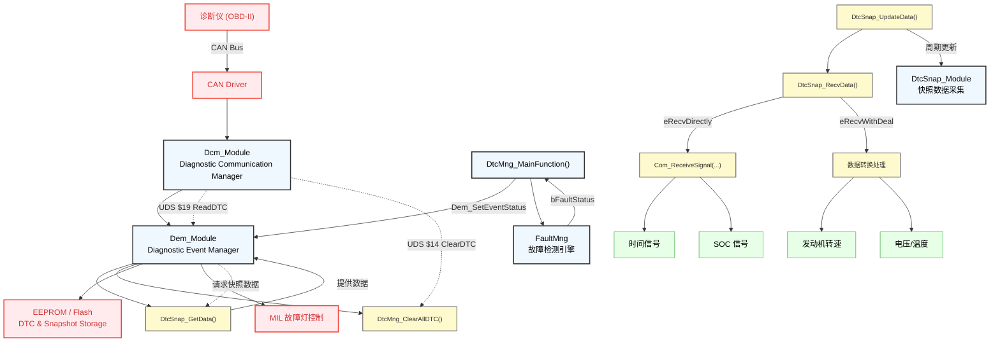

DTC（Diagnostic Trouble Code，诊断故障码）快照数据管理系统的模块，主要用于在汽车电子控制单元（ECU）中采集与故障相关的环境数据，并在检测到故障时保存这些数据，供后续诊断分析使用。
<!-- DTC快照数据管理系统通常包括以下几个主要模块：
1. 数据采集模块：负责从ECU中采集与故障相关的环境数据，如车速、发动机转速、进气温度、燃油压力等。这些数据可以帮助诊断人员了解故障发生时的车辆状态。
2. 数据存储模块：负责将采集到的数据存储在本地或远程数据库中，以便后续分析和检索。数据存储模块通常包括数据压缩、加密、备份等功能，以确保数据的完整性和安全性。
3. 故障检测模块：负责检测ECU中的故障，并在检测到故障时触发数据采集和存储过程。故障检测模块通常基于故障码（DTC）和故障症状，通过比较ECU中的实际值与预设的阈值来判断是否存在故障。
4. 数据检索模块：负责根据诊断需求检索和展示存储的故障数据。数据检索模块通常支持多种查询条件，如故障码、时间范围、车辆状态等，以便诊断人员快速定位故障原因。
5. 数据分析模块：负责对存储的故障数据进行深入分析，以帮助诊断人员找出故障的根本原因。数据分析模块通常包括故障模式识别、故障原因分析、故障预测等功能，以提高诊断效率和准确性。
6. 用户界面模块：负责提供用户友好的界面，以便诊断人员轻松访问和管理DTC快照数据。用户界面模块通常包括数据展示、故障诊断、故障报告等功能，以满足不同用户的需求。
7. 系统管理模块：负责对DTC快照数据管理系统进行配置、监控和维护。系统管理模块通常包括用户管理、权限控制、日志记录等功能，以确保系统的稳定性和安全性。
通过以上模块的协同工作，DTC快照数据管理系统可以有效地采集、存储、检索和分析与故障相关的环境数据，为汽车诊断提供有力的支持。 -->
Dem（Diagnostic Event Manager）诊断事件管理器，主要用于DCT状态管理，故障灯控制（MIL），快照数据管理，将 DTC 及其相关信息保存到EEPROM/Flash等。当一个DTC被激活时，Dem会主动请求快照数据。Dem_Module --(调用)--> DtcSnap_GetData(eDataIdx, buffer)

Dcm（Diagnostic Communication Manager）诊断通讯管理器，主要用于接收/发送UDS报文，解析服务 ID、子功能、DTC类型等参数,调用对应的底层函数实现服务（如调用Dem读取DTC）等。Dcm不直接调用DtcMng模块，而是通过标准接口间接协作。

| 模块/函数 | 所属文件 | 主要作用 |
|----------|---------|--------|
| DtcMng_MainFunction() | DtcMng.c | 主任务函数：周期性更新 DTC 状态|
| Dem_SetEventStatus(eId, status) | DtcMng.c 内调用 | 上报某个 DTC 的当前状态（FAIL/PASS）|
| Dem_SetEnableCondition(id, en) | DtcMng.c 内调用 | 设置该 DTC 是否允许被触发|
| DtcMng_ClearAllDTC() | DtcMng.c | 清除所有可清除的 DTC |
| DtcSnap_UpdateData() | DtcSnap.c | 周期性刷新快照缓冲区数据 |
| DtcSnap_RecvData() | DtcSnap.c | 分发数据采集任务：直接复制 or 带转换处理|
| DtcSnap_ReadDateAndTime() | DtcSnap.c | 采集时间戳数据（年月日时分秒）|
| DtcSnap_ReadEngineSpeed() | DtcSnap.c | 采集发动机转速（占位函数）|
| DtcSnap_ReadPowerBatterySOC() | DtcSnap.c | 采集动力电池 SOC（占位函数）|
| DtcSnap_GetData() | DtcSnap.c | 提供给 Dem 模块读取快照数据的接口 |

流程：
1.DTC上报：FaultMng → DtcMng_MainFunction → Dem_SetEventStatus → Dem记录 + MIL点亮
2.快照采集：DtcSnap_UpdateData → DtcSnap_RecvData → 从CAN/传感器读取 → 存入缓冲区
3.诊断仪读取DTC：诊断仪 → Dcm → Dem_ReadDtcInformation → Dem调用DtcSnap_GetData → 返回带快照的响应
4.诊断仪清除DTC：诊断仪 → Dcm → Dem_ClearDiagnosticInformation → Dem调用 DtcMng_ClearAllDTC → Dem记录 + MIL熄灭

