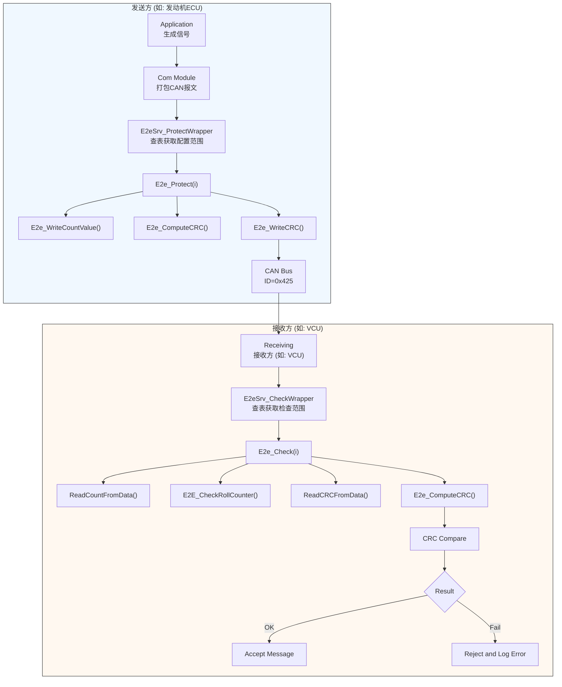

E2E（End-to-End Protection）是一种用于汽车电子系统的“端到端数据保护机制”，它的核心目标是：
 - 防止数据被篡改（完整性）
 - 防止重放攻击（新鲜度）
 - 检测丢包或错序（顺序性）
 - 使用CRC校验→接收方重新计算CRC，不一致则丢弃
 - 使用Rolling Counter→只接受递增的消息，跳跃过大为异常，一般为4字节（0~15）
它就像给每条消息贴上“防伪标签 + 编号”，确保通信双方能判断这条消息是不是真的、新的、完整的。 

