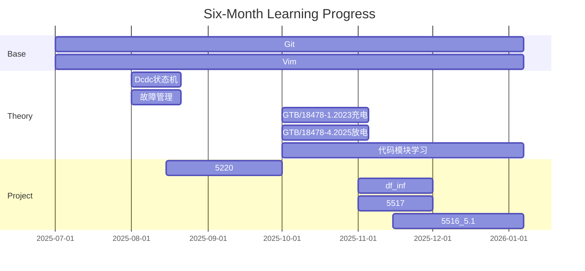

• **S+、S-、CC、CP这些线分别是什么意思？起到什么作用？**
S+、S-：充电通信线（CAN-H/CAN-L），是直流充电场景专属的差分通信线路。
CC：充电连接确认线，是检测充电连接装置（充电枪 / 插座）是否完全插合。
CP：控制导引线，是交流充电场景专属的控制线路。
• **电气间隙？**
指的是：两个导电部件之间在空气中的最短绝缘距离。
设计目的：防止两导电部件之间因电压过高导致空气被击穿，产生电弧或漏电，进而引发电击、火灾或设备损坏。
• **电涌保护器在哪里需要装配？只在直流供电设备中才使用吗？（p43）**
电涌保护器SPD：一种用于限制瞬态过电压（如雷击、开关操作引起的浪涌）并对泄放电流提供通路的装置。
直流交流均可使用，应在所有可能遭受雷击或电压瞬变的电力与信号接口处安装。
• **为什么允许表面温度金属部分比非金属部分温度低？金属不是更容易导电发热吗？（p48）**
是人体可接受的温度，并不是本身的温度，所以金属要更低。
• **为什么充电电缆的过载保护只在连接方式c下提供？**
因为在连接方式 A 和 B 中，充电电缆属于“外部设施”，其过载保护由供电设备负责；而在方式 C 中，电缆是车辆的一部分，因此必须由车辆提供完整的保护功能。
• **当未配备S2时，为什么车辆插座没有电子锁？**
S2实现电子锁功能的前提条件之一。车辆不配备 S2，则无法通过标准定义的 CP 信号变化来可靠判断“是否允许解锁”，从而难以实现安全的电子锁控制逻辑。
• **为什么直流充电没有多个连接方式的原理图？**
其物理连接结构高度标准化、统一化——目前全球主流标准都采用“充电电缆固定在供电设备上”的单一模式，即相当于交流的“连接方式A”。
• **为什么附件B电路电动汽车侧有IMD，而附件C没有？**
IMD 绝缘监测装置：用于检测高压系统（HV+ / HV-）与地之间的绝缘电阻。
图B.1是一个完整的直流充电安全框架，图C.1是一个简化版的框架。
图C.1中的 “Rload + Sload” 电路实际上是一种等效绝缘监测方案，它通过向系统注入微小电流并测量压降来推算绝缘电阻，而不是使用传统 IMD 模块。
• **为什么有的电路有绝缘监测IMD，而有的电路没有，在什么情况下需要连接IMD，什么情况下不需要？**
只是要求整个充电系统必须实现绝缘监测功能，可以在充电桩内置IMD或等效监测法。
• **FUSE是什么作用，是怎么构成的？每次熔断都需要更换？**
保险丝，当电流过大时自动“熔断”，切断电路，防止设备损坏或火灾发生。
• **为什么直流充电必须配备电子锁？**
直流充电高能 → 带电拔枪 → 电弧火灾，而交流充电功率低。

***

