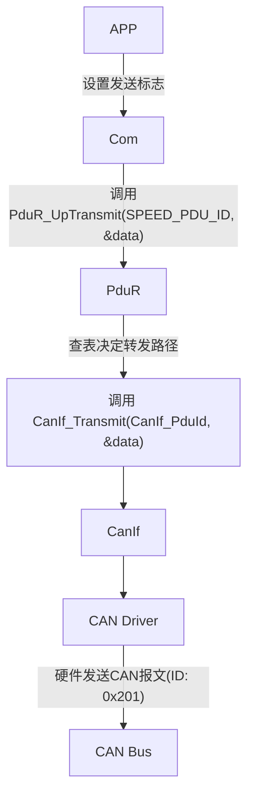
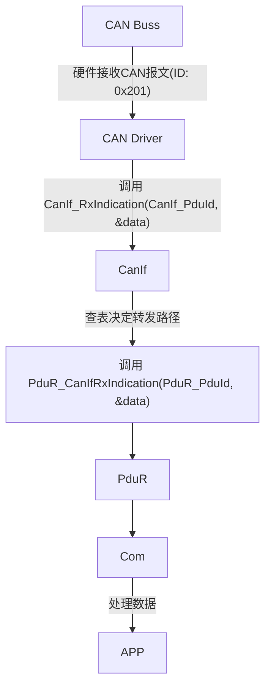

PduR（Protocol-Data-Unit Router）：主要作用是在不同通信协议层之间路由协议数据单元PDU，例如在 CanIf ↔ PduR ↔ I-PDU Router (如 Com 模块) 或传输层与上层应用之间转发数据。
例如：PduR收到了一个来自CanIf的消息，查了一下配置表，发现应该交给Com模块处理，于是调用Com_RxIndication()把数据传过去。（上行路由）
***
为什么需要路由机制？
路由就像交警，不直接进行“数据传输”，而是“指挥数据该怎么走”。
|原因|解释|
|---|---|
|解耦模块依赖|CanIf 不需要知道 Com 存不存在；Com 也不需要知道数据来自哪个硬件|
|提高可配置性|只改配置表就能改变数据流向，不用重写代码|
|支持多目的地广播|一个信号可以同时给仪表 + TBOX + 诊断模块|
|便于测试与仿真|可以模拟路由路径进行单元测试|
|支持网关功能|实现不同总线之间的数据桥接（如 CAN-to-Ethernet）|
***
函数介绍
|函数名|类型|功能|
|---|---|---|
|PduR_Init|初始化函数|用于初始化 PduR 模块配置|
|PduR_UpTransmit|上行发送请求|从高层协议（如 Com 或 Dcm）向底层接口（如 CanIf）发起发送请求|
|PduR_CanIfRxIndication|接收指示回调|当CanIf收到CAN报文后通知PduR，由PduR转发给上层|
|PduR_CanIfTxConfirmation|发送确认回调|当底层成功发送报文后，通知上层发送完成|

### 车载通信下行路由流程图（Down-Routing）

### 车载通信上行路由流程图（Up-Routing）
