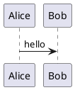
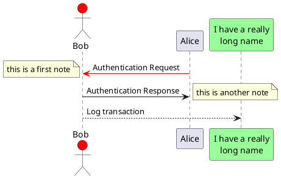
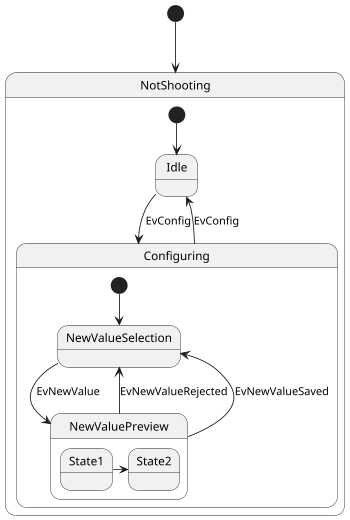
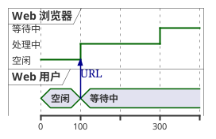
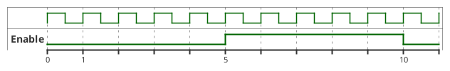
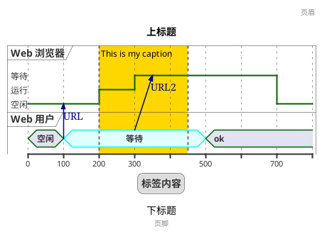
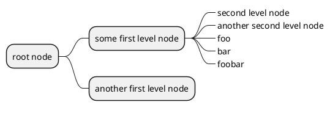
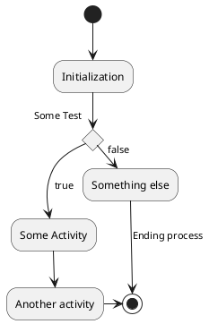
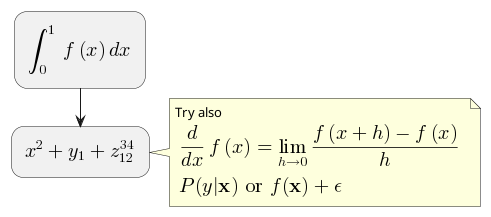

```plantuml

@startuml
Alice -> Bob:hello
@enduml

```

***
- ## 时序图

```plantuml
@startuml
actor Bob #red
' The only difference between actor and participant is the drawing
participant Alice
participant "I have a really\nlong name" as L #99FF99
/' You can also declare:participant L as "I have a really\nlong name" #99FF99'/
Alice-[#red]>Bob: Authentication Request
note left:this is a first note
Bob->Alice: Authentication Response
note right:this is another note
Bob-->L: Log transaction
@enduml
```

***
- ## 状态图

```plantuml
@startuml
scale 350 width
[*] --> NotShooting
state NotShooting {
[*] --> Idle
Idle --> Configuring : EvConfig
Configuring --> Idle : EvConfig
}
state Configuring {
[*] --> NewValueSelection
NewValueSelection --> NewValuePreview : EvNewValue
NewValuePreview --> NewValueSelection : EvNewValueRejected
NewValuePreview --> NewValueSelection : EvNewValueSaved
state NewValuePreview {
State1 -> State2
}
}
@enduml
```

***
- ## 定时图
  

```plantuml
@startuml
robust "Web 浏览器" as WB
concise "Web 用户" as WU
@0
WU is 空闲
WB is 空闲
@100
WU->WB:URL
WU is 等待中
WB is 处理中
@300
WB is 等待中
@enduml
```

```plantuml
@startuml
clock clk with period 1
binary "Enable" as EN
@0
EN is low
@5
EN is high
@10
EN is low
@enduml
@enduml
```

```plantuml
@startuml
Title 上标题
header: 页眉
footer: 页脚
legend
标签内容
end legend
caption 下标题
robust "Web 浏览器" as WB
concise "Web 用户" as WU
@0
WU is 空闲
WB is 空闲
@100
WU -> WB : URL
WU is 等待#LightCyan;line:Aqua
@200
WB is 运行
@300
WU -> WB@350 : URL2
WB is 等待
@+200
WU is ok
@+200
WB is 空闲
highlight 200 to 450 #Gold;line:DimGrey : This is my caption
@enduml
```

***
- ## 思维导图

```plantuml
@startmindmap
* root node
** some first level node
***_ second level node
***_ another second level node
***_ foo
***_ bar
***_ foobar
** another first level node
@endmindmap
```

***
- ## 活动图

```plantuml
@startuml
(*) --> "Initialization"
if "Some Test" then
-->[true] "Some Activity"
--> "Another activity"
-right-> (*)
else
->[false] "Something else"
-->[Ending process] (*)
endif
@enduml
```

***
- ## 公式

```plantuml
@startuml
:<math>int_0^1f(x)dx</math>;
:<math>x^2+y_1+z_12^34</math>;
note right
Try also
<math>d/dxf(x)=lim_(h->0)(f(x+h)-f(x))/h</math>
<latex>P(y|\mathbf{x}) \mbox{ or } f(\mathbf{x})+\epsilon</latex>
end note
@enduml
```