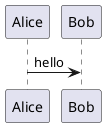
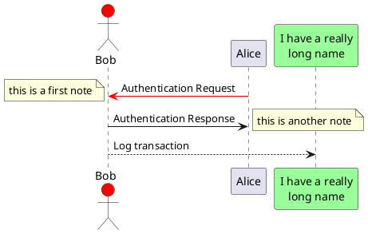
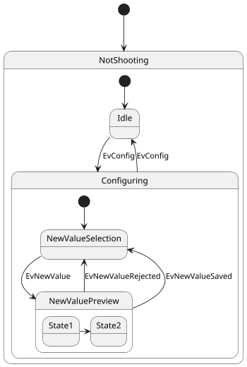
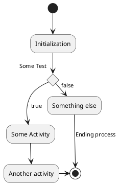

```plantuml

@startuml
Alice -> Bob:hello
@enduml

```

***
- 时序图

```plantuml
@startuml
actor Bob #red
' The only difference between actor and participant is the drawing
participant Alice
participant "I have a really\nlong name" as L #99FF99
/' You can also declare:participant L as "I have a really\nlong name" #99FF99'/
Alice-[#red]>Bob: Authentication Request
note left:this is a first note
Bob->Alice: Authentication Response
note right:this is another note
Bob-->L: Log transaction
@enduml
```

***
- 状态图

```plantuml
@startuml
scale 350 width
[*] --> NotShooting
state NotShooting {
[*] --> Idle
Idle --> Configuring : EvConfig
Configuring --> Idle : EvConfig
}
state Configuring {
[*] --> NewValueSelection
NewValueSelection --> NewValuePreview : EvNewValue
NewValuePreview --> NewValueSelection : EvNewValueRejected
NewValuePreview --> NewValueSelection : EvNewValueSaved
state NewValuePreview {
State1 -> State2
}
}
@enduml
```

***
- 活动图

```plantuml
@startuml
(*) --> "Initialization"
if "Some Test" then
-->[true] "Some Activity"
--> "Another activity"
-right-> (*)
else
->[false] "Something else"
-->[Ending process] (*)
endif
@enduml
```
